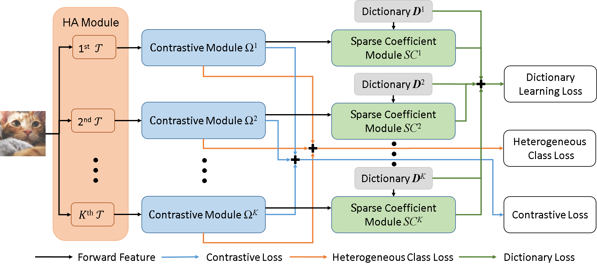

# ADMM-SRNet

## ADMM-SRNet: Alternating Direction Method of Multipliers based Sparse Representation Network for One-Class Classification

The paper is accepted by IEEE Transactions on Image Processing, 2023.
https://ieeexplore.ieee.org/document/10124145

The source code will be available soon. 

## Usage

## Instructions for Code:

### Requirements

### Training

### Testing

### Comparison with State-of-the-art Methods (%)

## Reference 

Please cite the following paper when you apply the code. 

[1] C.-Y. Chiou, K.-T. Lee, C.-R. Huang and P.-C. Chung, "ADMM-SRNet: Alternating Direction Method of Multipliers based Sparse Representation Network for One-Class Classification," IEEE Transactions on Image Processing, vol. 32, pp. 2843-2856, 2023, doi: 10.1109/TIP.2023.3274488.

[2] K.-T. Lee, C.-Y. Chiou and C.-R. Huang, "One-Class Novelty Detection via Sparse Representation with Contrastive Deep Features," in Proc. International Computer Symposium (ICS), 2020, pp. 61-66, doi: 10.1109/ICS51289.2020.00022.

